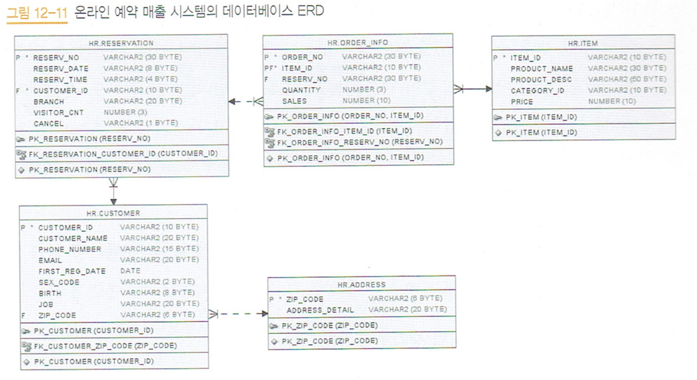

## 💻 Personal Project 2

### 1. 프로젝트
* 모두의 SQL 실습 클론코딩

## [프로젝트 개요]

온라인 전용 상품 시장 반응 분석

## [프로젝트 목표]

1. 실습에서 제공하는 예약 데이터와 매출 데이터를 토대로 데이터 분석
2. oracle 문법을 mariadb 문법으로 바꾸기
3. 기본 SQL문을 학습하고, 데이터 분석 실습을 통해 실무에서 SQL 활용을 학습.

## [ERD] <br>


1. 테이블은 customer, address, reservation, order_info, item으로 구성되어 있다.
2. 주소는 고객을 여러 건 갖는다. 주소가 없어도 고객은 존재할 수 있다.
3. 고객은 예약을 여러 건 갖는다. 고객 없이는 예약이 존재할 수 없다.
4. 예약은 주문을 여러 건 갖는다. 예약 정보 없이도 주문 정보는 존재할 수 있다.
5. 상품 주문은 여려 건 갖는다. 상품이 없다면 주문은 존재할 수 있다.
## [배운점]

### 1. 테이블 생성

- CONSTRAINT PK*이름 PRIMARY KEY (적용 컬럼):
  - PK*이름으로 적용 컬럼을 PK로 생성합니다.
- ALTER TABLE customer <br> ADD CONSTRAINT fk_customer_zip_code <br> FOREIGN KEY (zip_code) <br>REFERENCES address (zip_code);: 
  - customer 테이블의 zip_code를 customer_zip_code이름으로 FOREIGN KEY로 지정하고, <br> 이는 address 테이블의 (zip_code)를 참조한다.

### 2. INSERT

- to_date('17/11/07','RR/MM/DD'): to_date(str, 형식)

- str_to_date('17/11/08','%y/%m/%d'): date 값의 형식을 바꿈

### 3. Function
[Oracle to Mariadb]
- DECODE(컬럼, 조건1, 결과1, 조건2, 결과2, 조건3, 결과3..........) 
  - case <br>
       when 조건1  then  반환값 <br>
       when 조건2  then  반환값 <br>
       else 반환값 <br>
      end<br>
- TO_DATE("문자열", "날짜 포맷"): 문자열을 날짜 데이터로 변경
  - STR_TO_DATE(str, format)
  - format 종류: <br> 
    %Y=4자리 년도, %y=2자리 년도 <br>
    %m=2자리 월, %d=2자리 일 <br>
- TO-CHAR("날자 데이터", '반환'): 날자 데이터에서 특정 포맷을 반환
  - DATE_FORMAT(date, '출력할 포맷')

[fuction]
- SUBSTR(str, pos, len) : str문자열을 pos번째 부터 len개 글자만 가져오기
- ROUND(값, 자리수): 값을 자리수까지만 반올림하여 출력
- CONCAT(str1, str2): 문자열 합치기
  - str1이 숫자이고, str2이 문자이면 str1을 문자로 자동 형변환이 적용된다.
-  RANK() over  : 동률을 같은 등수로 처리. 다음 등수를 동률의 수 만큼 제외하고 등수로 매김 <br>
   DENSE_RANK() over : 동률을 같은 등수로 처리하지만, 다음 등수를 동률의 수 만큼 제외하지 않고 바로 등수로 매김 <br>
   ROW_NUMBER() over : 동률을 반영하지 않는다. 즉, 동일한 등수는 존재하지 않고 모든 행은 다른 등수를 가짐.
   - PARTITION BY: 전체 순서가 아닌, 그룹별 순서로 순위를 매김
### 4. 조인
[외부조인]
-  테이블의 공통된 속성 외의 속성을 조회하고 싶을 때 외부조인을 한다.
  - [SQL문] <br>
```roomsql
FROM reservation A LEFT OUTER JOIN order_info B
ON A.reserv_no = B.reserv_no
AND A.cancel = 'N'
```
[해석]<br>
order_info 테이블은 reservation 테이블을 외부 조인한다. <br>
두 테이블은 공통된 reserv_no 값과 A.cancel = 'N' 값을 갖고 있다. <br>
하지만, A테이블만 갖고 있는 A.cancel = 'Y'인 속성을 조회하고 싶다면, 외부조인을 해야 한다.

### 5. 인라인 뷰
- [개념] <br>
  FROM절에서 사용되는 서브쿼리 이며, 서브쿼리에서 조회한 결과를 하나의 테이블처럼 사용하고 싶을때 사용됩니다
- [주의사항] <br>
  1. 인라인 뷰(Inline View) 서브쿼리는 SELECT 문으로만 작성이 가능합니다
  2. 인라인 뷰(Inline View) 서브쿼리는 ( ) - "괄호" 안에 작성해야 됩니다.
  3. 인라인 뷰(Inline View) 서브쿼리에서 조회한 컬럼만 메인쿼리에서 조회가 가능합니다.
  4. 인라인 뷰(Inline View) 사용지 별칭을 지정해야 됩니다.
  5. 메인쿼리에서 인라인 뷰(Inline View)의 컬럼을 조회시 별칭을 지정해야 됩니다.
- [예시] <br>
```roomsql
FROM
  -- 인라인 뷰 정의
  (
  SELECT A.reserv_date,
  C.product_name,
  -- STR_TO_DATE: 문자열 타입인 reserv_date를 date타입으로 변경
  -- date_format: 해당 date 값 중에서 day의 값을 추출
  -- % 7 연산으로 요일명을 정의할 때 용이하도록 함
  (date_format(STR_TO_DATE(A.reserv_date, '%Y%m%d'),'%d') % 7 ) WEEK,
  B.sales
  -- 판매된 상품의 정보에서만 select
  FROM reservation A, order_info B, item C
  WHERE A.reserv_no = B.reserv_no
  -- item_id='M0001'인 항목에 대해서만 select
  AND   B.item_id   = C.item_id
  AND   B.item_id = 'M0001'
  -- 해당 결과 테이블을 A 테이블이라고 정의(인라인 뷰)
  ) A 
```
